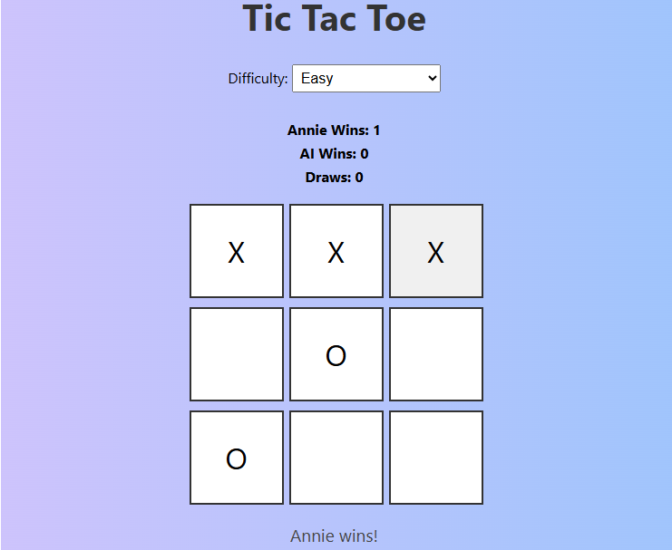

# 🎮 Tic Tac Toe with AI

A modern Tic Tac Toe game built using HTML, CSS, and JavaScript. Play against a smart AI that adapts based on difficulty, track your wins, and enjoy a clean, responsive design.

---

## 🚀 Features

- 🧠 **AI Opponent** using Minimax algorithm (Hard mode is unbeatable!)
- 🎯 **Difficulty Modes** – Easy (random mistakes) and Hard (perfect AI)
- 🙋‍♀️ **Player Name Input** with personalized status messages
- 🏆 **Score Tracking** – Player Wins, AI Wins, and Draws
- 💡 **Responsive Design** – Works great on mobile and desktop
- ✨ **Modern UI** – Clean layout, soft shadows, and smooth interactions

---

## 📸 Screenshots

Here’s a look at the game in action:

## 📂 Folder Structure

tic-tac-toe/docs/

├── index.html

├── style.css

└── script.js

## 🌐 Live Demo

> [Play it online here](https://hi-soul-surfer.github.io/Tic-Tac-Toe/)

---

## 📫 Contact

Created with ❤️ by [Himanshi Sharma](https://linkedin.com/in/himanshi-sharma-731/)
